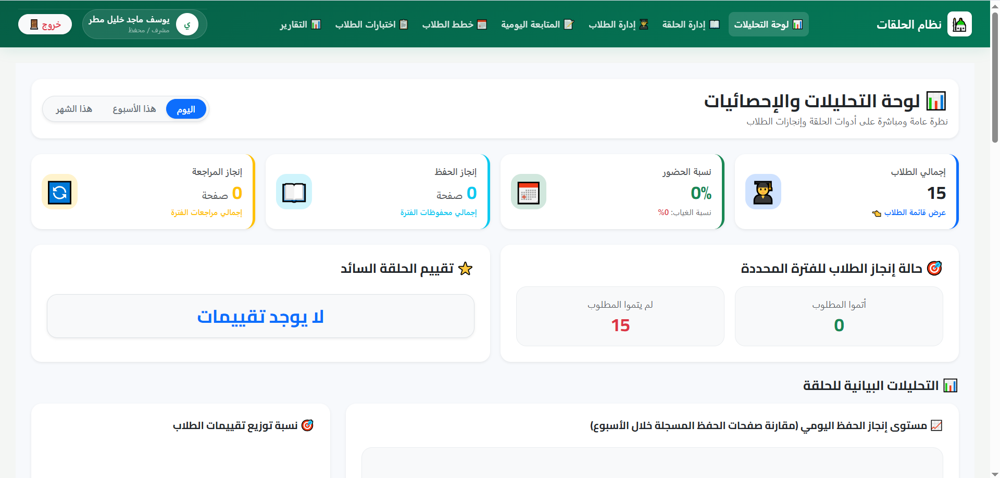

<div align="center">

# 📖 Quran Circles Management System

**A modern web application for managing Quran memorisation circles and tracking student progress effectively.**

[Features](#-features) · [Built With](#️-built-with) · [Getting Started](#-getting-started) · [Project Areas](#-project-areas) · [Screenshots](#-screenshots) · [Author](#-author)

</div>

---

## 📖 About the Project

**Quran Circles Management System** is a full-stack web application designed to manage Quran memorisation circles and track student progress. It helps teachers organise students, record daily progress, create study plans, manage assessments, and review comprehensive performance reports.

This project was built as part of a professional portfolio to demonstrate clean architecture, practical data handling, and structured educational workflow design.

## ✨ Features

- **Teacher & Circle Management:** User registration and a dedicated Quran circle for each teacher.
- **Student Management:** Efficient student management, searching capabilities, and bulk Excel import.
- **Study & Revision Plans:** Customised memorisation and revision plans for students.
- **Daily Tracking:** Comprehensive daily tracking for memorisation, revision, and attendance.
- **Smart Calculations:** Automatic page calculation from selected Surah and Ayah ranges.
- **Assessments:** Student assessments and results management.
- **Analytics & Reports:** Dashboard, performance statistics, absence tracking, and detailed reports.
- **Parent Portal:** A dedicated parent-facing page for tracking a student's progress and attendance.

## 🛠️ Built With

- **Backend:** PHP 8.3, Laravel 13, Eloquent ORM
- **Frontend:** Blade templates, Tailwind CSS, Alpine.js
- **Database:** SQLite for local development (or any database supported by Laravel)
- **Tools & Packages:** Vite, npm, Composer, Git, Laravel Excel

## 🚀 Getting Started

### Prerequisites

- PHP 8.3 or later
- Composer
- Node.js and npm

### Setup

1. Clone the repository and enter the project directory:

   ```bash
   git clone https://github.com/matar-yousef/quran-circles.git
   cd quran-circles
   ```

2. Install the PHP and JavaScript dependencies:

   ```bash
   composer install
   npm install
   ```

3. Create the environment file and generate an application key:

   ```bash
   cp .env.example .env
   php artisan key:generate
   ```

   On Windows PowerShell, use the following command instead:

   ```powershell
   Copy-Item .env.example .env
   ```

4. Configure the database in `.env`. For local SQLite development, make sure the SQLite database file exists and the connection settings are correct.

5. Run migrations and seeders:

   ```bash
   php artisan migrate --seed
   ```

6. Build the frontend assets and start the application:

   ```bash
   npm run build
   php artisan serve
   ```

Open [http://127.0.0.1:8000](http://127.0.0.1:8000) in your browser.

## 🧭 Project Areas

This project is structured into two main areas:

### 👥 Users

- **Teacher:** Manages students and circles.
- **Parent:** Views student progress and attendance.

### 📘 System Modules

- **Authentication:** User registration, login, and password reset.
- **Circles:** Quran circles management.
- **Students:** Student management.
- **Study Plans:** Memorisation and revision plans.
- **Daily Tracking:** Daily tracking of memorisation, revision, and attendance.
- **Assessments:** Student assessments.
- **Reports:** Analytics and reports.

## 🖼️ Screenshots

| Dashboard | Students Management | Daily Tracking |
| :---: | :---: | :---: |
|  |  |  |

| Student Plan | Parent Portal |
| :---: | :---: |
|  |  |

## 👨‍💻 Author

**Yousef Matar**

- GitHub: [@matar-yousef](https://github.com/matar-yousef)
- LinkedIn: [Your Profile Name](https://www.linkedin.com/in/yousef-matar-28264a422/)
- Email: [dev.yousef.matar@gmail.com] 